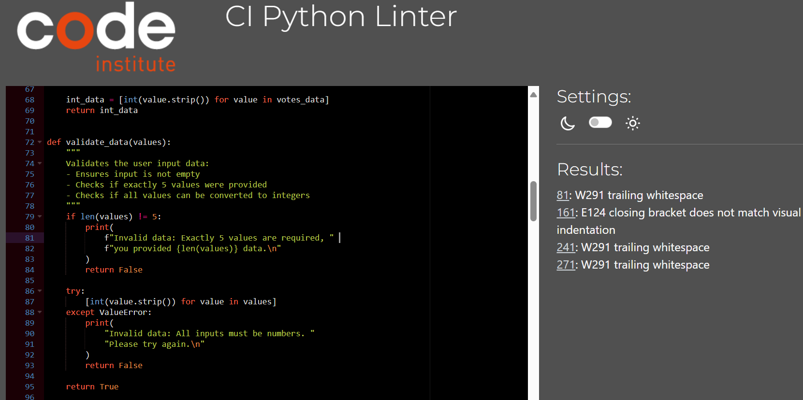
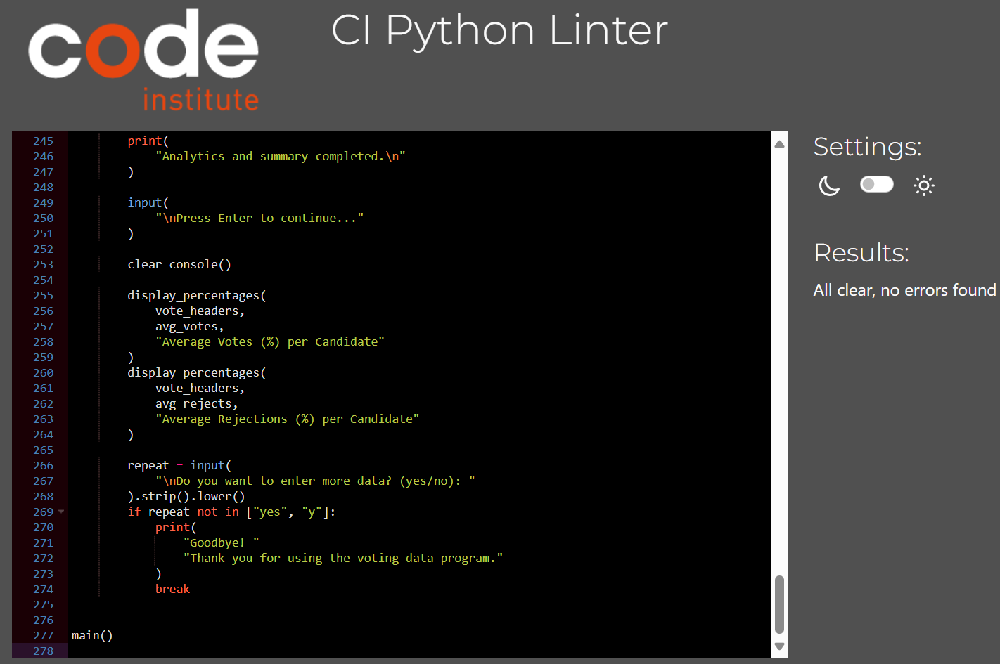

# Voting and Rejection Data Analyzer  

This terminal-based application allows users to input voting and rejection data for candidates, store the data in Google Sheets, and automatically analyze results with averages, top candidates, and summary percentages.  

## Description  

This script collects data regarding the most and least voted candidates.
The goal is to help analyze electoral preferences by calculating column averages, identifying the top-voted and most-rejected candidates, and displaying percentage charts.  

It integrates with Google Sheets using the gspread and google-auth libraries.  

## Features  

**Existing features**  
This project was developed to allow users to input, store, and analyze voting and rejection data for candidates directly through the terminal. When the program runs, the user is guided by clear instructions on how to properly enter the data. After validating the input, the script sends the data to specific worksheets on Google Sheets, separating positive votes and rejection votes into different tabs.

A key feature is the input validation system, which ensures that users provide exactly five numeric values separated by commas. If the input is invalid, informative error messages are displayed until the data is correctly formatted. Once the data is submitted, the program automatically retrieves all existing records from the spreadsheets, calculates the average votes and rejections for each candidate, and updates a worksheet with these averages.

Additionally, the script identifies the most voted and most rejected candidates and generates a short analytical summary, which is also sent to the spreadsheet. Finally, the terminal displays the results as percentages, making it easy to visually understand the distribution of votes and rejections per candidate.

The user interaction is clear and educational, making the process intuitive even for those with little technical experience.

**Future features**  
Among several possible implementations, in the future I intend to implement data visualization using graphs to help users better interpret the results. I will seek improvements to make the program more robust, easy to use and suitable for a wider range of real-world applications.

## Data Model  

The data model for this project is structured around Google Sheets, where voting and rejection data are stored, processed, and analyzed. The structure is organized into multiple worksheets, each serving a specific purpose:  

**Worksheets Structure**  

- Votes Worksheet

   - Stores the number of votes received by each candidate.
   - Each row represents a new data entry submitted by the user.
   - Columns correspond to individual candidates (Mary,Joseph, David, Deborah, None of them).

- DoNotVote Worksheet

   - Stores the number of rejection votes (votes against) for each candidate.
   - Follows the same structure as the "Votes" worksheet, with rows representing new entries and columns corresponding to candidates.

## How to Use  

## Testing  

**Manual Testing**  
- All data inputs were validated to reject incorrect or incomplete formats.  
- Successfully tested reading and writing to Google Sheets.  
- Ensured calculations of averages and percentages return expected results.  
- Output was reviewed for clarity and usability in the terminal.  

**Validator Testing**  
- No errors were returned from PEP8 validator anymore.

**BEFORE**  

**AFTER**  

## Deployment  

This project was deployed as per the guidance in Love Sandwiches Walkthrough Project.

- Steps for deployment:

  - Fork or clone this repository
  - Create a new Heroku app
  - Set the buildbacks to Python and NodeJS in that order
  - Link the Heroku app to the repository
  - Click on Deploy

## Credits  

