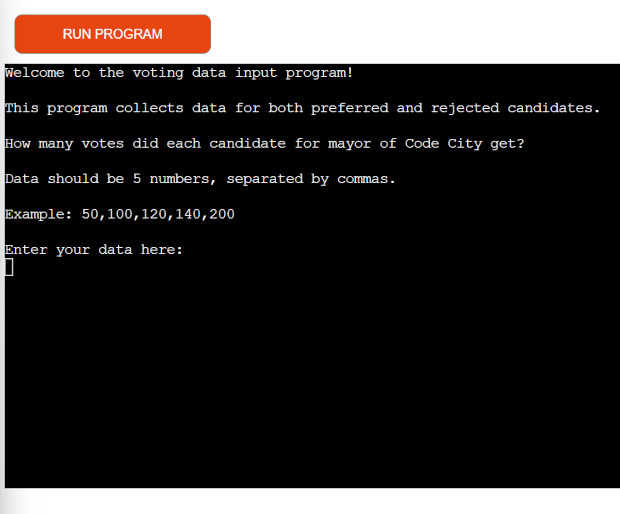
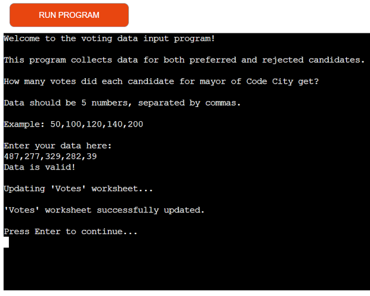
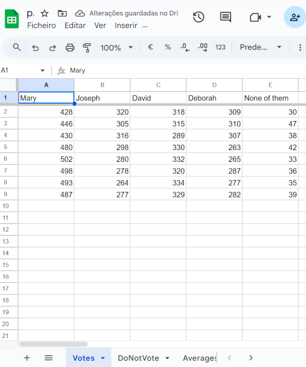
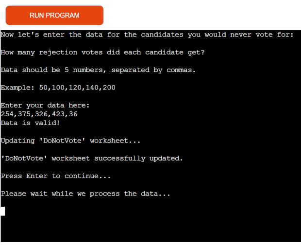
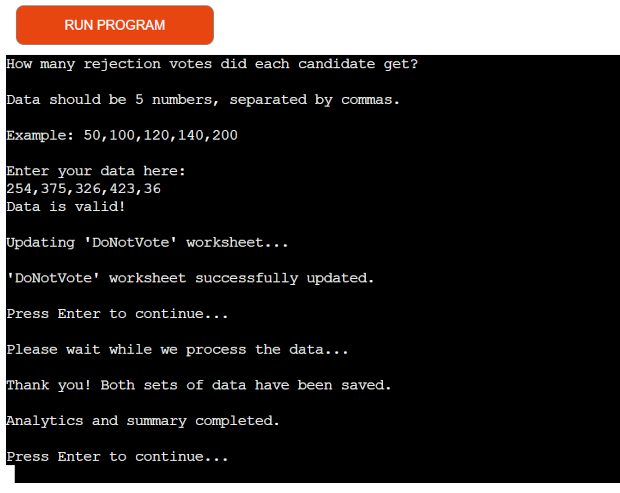
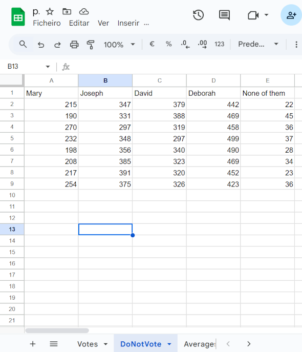
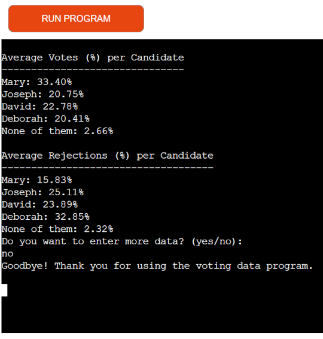
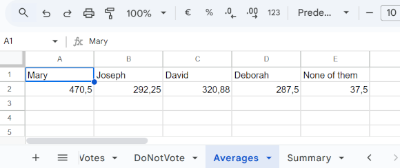
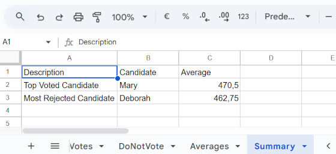
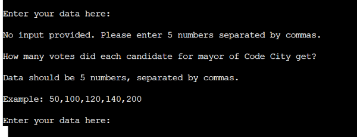

# Voting and Rejection Data Analyzer  

This terminal-based application allows users to input voting and rejection data for candidates, store the data in Google Sheets, and automatically analyze results with averages, top candidates, and summary percentages.  

## Description  

This script collects data regarding the most and least voted candidates.
The goal is to help analyze electoral preferences by calculating column averages, identifying the top-voted and most-rejected candidates, and displaying percentage charts.  

It integrates with Google Sheets using the gspread and google-auth libraries.  

## How to Use  

When accessing the website " https://voting-data-analyzer-bed5d832188a.herokuapp.com/ " the program starts requesting the data.  

  

After entering the 5 numbers as requested, the system informs whether the data is validated and asks for "enter" to continue.  

  

A new row with the data appears in the Vote worksheet and the next question displays.  

  

  

After the second set of data and validation the program informs that it is processing the data and ask to wait. 

  

The program informs that both sets of data have been saved and asks the user to press "enter".  

  

Updated DoNotVote worksheet:

  

Information is displayed on the percentages of votes and rejections of candidates.  
The user is asked if he/she wants to enter more information or finish.  
When typing "yes" the system returns with the initial question.  
When typing "no" the system ends with the phrase saying goodbye and thanks to the user.  

  

Updated Averages and Summary worksheets:  

  

  

When the user tries to enter a quantity of numbers other than 5 or letters, the program displays messages informing that the data is invalid.

  

By simply pressing enter, the user receives a message that no data was entered.  

 

## Data Model  

The data model for this project is structured around Google Sheets, where voting and rejection data are stored, processed, and analyzed. The structure is organized into multiple worksheets, each serving a specific purpose:  

**Worksheets Structure**  
- Votes Worksheet  

   - Stores the number of votes received by each candidate.  
   - Each row represents a new data entry submitted by the user.  
   - Columns correspond to individual candidates (Mary,Joseph, David, Deborah, None of them).  

- DoNotVote Worksheet  

   - Stores the number of rejection votes (votes against) for each candidate.  
   - Follows the same structure as the "Votes" worksheet, with rows representing new entries and columns corresponding to candidates.  

- Averages Worksheet

   - Stores the calculated averages of votes and rejection votes for each candidate.  
   - Contains two rows:  
     - Row 1: Candidate names (headers).
     - Row 2: Average values for each candidate.   

- Summary Worksheet

   - Provides a summary of the analysis, including:
     - The top-voted candidate.
     - The most-rejected candidate.
     - Their respective average values.
   - Contains three columns:
     - Description: Indicates the type of data (Top Voted Candidate and Most Rejected Candidate).
     - Candidate: The name of the candidate.
     - Average: The average value associated with the candidate.

**Data Flow**
- Input:

   - The user inputs data for both votes and rejection votes via the terminal.
   - The input must consist of exactly 5 numeric values separated by commas.

- Validation:

   - The input is validated to ensure it contains exactly 5 numbers.
   - Invalid inputs trigger error messages, prompting the user to re-enter the data.

- Storage:

   - Validated data is appended to the respective worksheets ("Votes" or "DoNotVote").

- Processing:

   - All data from the "Votes" and "DoNotVote" worksheets is retrieved.
   - Averages are calculated for each candidate using column-wise data.

- Analysis:

   - The candidate with the highest average votes is identified as the "Top Voted Candidate."
   - The candidate with the highest average rejection votes is identified as the "Most Rejected Candidate."
   - A summary of these results is generated and stored in the "Summary" worksheet.     

- Output:

   - The program displays the averages as percentages in the terminal for both votes and rejection votes.

**Validation Rules**
- Input must consist of exactly 5 numeric values separated by commas.
- All values must be integers.
- The program ensures that no empty or invalid data is processed.

## Features  

**Existing features**  
This project was developed to allow users to input, store, and analyze voting and rejection data for candidates directly through the terminal. When the program runs, the user is guided by clear instructions on how to properly enter the data. After validating the input, the script sends the data to specific worksheets on Google Sheets, separating positive votes and rejection votes into different tabs.

A key feature is the input validation system, which ensures that users provide exactly five numeric values separated by commas. If the input is invalid, informative error messages are displayed until the data is correctly formatted. Once the data is submitted, the program automatically retrieves all existing records from the spreadsheets, calculates the average votes and rejections for each candidate, and updates a worksheet with these averages.

Additionally, the script identifies the most voted and most rejected candidates and generates a short analytical summary, which is also sent to the spreadsheet. Finally, the terminal displays the results as percentages, making it easy to visually understand the distribution of votes and rejections per candidate.

The user interaction is clear and educational, making the process intuitive even for those with little technical experience.

**Future features**  
Among several possible implementations, in the future I intend to implement data visualization using graphs to help users better interpret the results. I will seek improvements to make the program more robust, easy to use and suitable for a wider range of real-world applications.

## Testing  

**Manual Testing**  
- All data inputs were validated to reject incorrect or incomplete formats.  
- Successfully tested reading and writing to Google Sheets.  
- Ensured calculations of averages and percentages return expected results.  
- Output was reviewed for clarity and usability in the terminal.  

**Validator Testing**  
- No errors were returned from PEP8 validator anymore.

**BEFORE**  

**AFTER**  

## Deployment  

This project was deployed as per the guidance in Love Sandwiches Walkthrough Project.

- Steps for deployment:

  - Fork or clone this repository
  - Create a new Heroku app
  - Set the buildbacks to Python and NodeJS in that order
  - Link the Heroku app to the repository
  - Click on Deploy

## Credits  

- The Love Sandwiches Walkthrough Project was extremely important. It was through this project that I got inspiration for the Voting and Rejection Data Analyzer, which helped me develop the initial codes and deployment.
- The overall structure of the project was thanks to classes at the Code Institute and research I did on the internet (YouTube, Google, ChatGPT, Copilot and GitHub).
- Formatting using autopep8, the clear_console function and input("Press Enter to continue...\n") were great recommendations from my mentor David Bowers.
- David also made me realize that I could also include an invalidation message when the program user pressed enter without entering data in the questionnaires that fill out the spreadsheet.